# ConsensysDevAcademyQ4CY18_project

## Idea
ACME Widget Company is a manufacturer that puts its widgets through a barrage of testing before each widget is sold.  Based on the testing, the widgets are "binned" so that widgets that meet better functionality and performance levels can be sold at a higher price (e.g. If widget 12345 can meet max performance from -50C to +150C, it is binned as a more expensive grade than if it could only meet max performance from -25C to +100C).  

ACME has factories, testing teams, and sales distributors worldwide.  So, it can be tricky to keep track of which widgets came from which factory and passed/failed what tests.  

Aside from knowing how to bin the widgets for pricing, keeping track of the test results long-term is an important problem because a small number of widgets may fail after they have been deployed "in the wild" by ACME's customers.  The ACME distributors would want to be able to look back at which factory, which test site, and what tests passed/failed for those widgets that failed "in the wild" and analyze that data in the context of the widget use case of their customer.

Using a DApp to track these widgets is an ideal application of the blockchain, because we want to co-ordinate information across multiple parties and also have an immutable record of the test results.

ACME is not concerned about publishing their widget test data on a public blockchain because their products are manufactured with the highest quality and their company has a core value of transparency to their customers.

## Library Used
OpenZeppelin SafeMath

## User Stories

For the scope of this project, we'll just test with 2 Admins (deployer + another Admin), 1 Tester, 1 Sales distributor, and a  Customer.

### Admin
Admin registers individuals in role of Tester, Sales distributor, or Customer.

Admin can trigger the circuit breaker if it looks like a customer is trying to steal widgets by hacking.

### Tester
Tester records factory the widget came from, the test site, and the test results.

### Sales distributor
Sales distributor has the ability to update the unit price for each bin and the test mask that maps test results into a given bin.

### Customer
Customers buy widgets with Ether.

## How to set up the Truffle project on local dev server

### Prerequisites

This is what I tested with.  If you test with a different system, your mileage may vary:
* VirtualBox VM running Ubuntu 18.10 with 4MB RAM, 64 MB video memory
* NodeJS v11.2.0
* npm 6.4.1
* truffle v4.1.14
* Ganache CLI v6.2.3 (ganache-core: 2.3.1)
* Web browser with MetaMask

### Steps

#### Local development server

##### 1) Clone the repository
```
git clone https://github.com/nathalie-ckc/ConsensysDevAcademyQ4CY18_project.git
```

##### 2) Get into the folder and make sure you are on master branch
```
cd ConsensysDevAcademyQ4CY18_project/
git checkout master
```

##### 3) Use NPM to install the necessary packages
```
npm install
```

##### 4) Start Ganache CLI
Open a new terminal in the project directory
```
ganache-cli
```
My project assumes that it's set up for port 8545 (per the course project requirements).  You should see this line in your Ganache CLI terminal:
```
Listening on 127.0.0.1:8545
```
Copy and paste the accounts mnemonic somewhere handy for later, when we will interact with the blockchain.
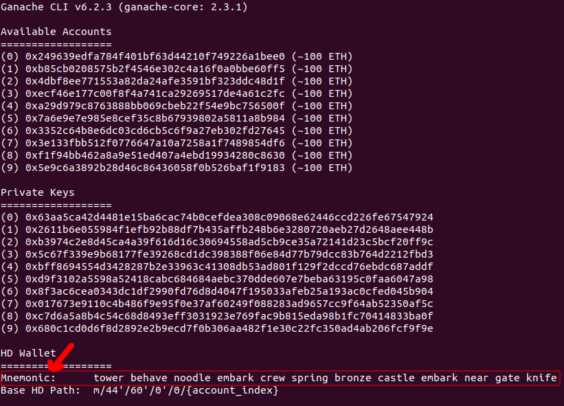

##### 5) Run the automated truffle tests
```
truffle test
```
You should see transactions and blocks being reported in your Ganache CLI terminal.  The test results should look something like this:
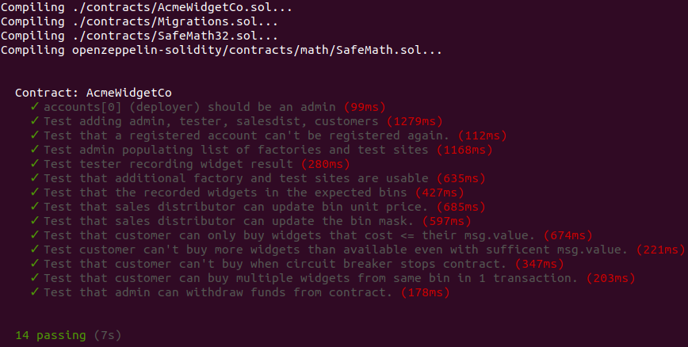

##### 6) Interact manually with the User Interface in a web browser
If you look at the project directory before running the next command, it will look like:
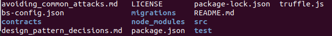
Now, compile the project in truffle.  (The earlier 'truffle test' did a cleanroom test, so we don't have the build artifacts from that lying around.)
```
truffle compile
```
Now you will see a 'build' directory appear in the project directory:
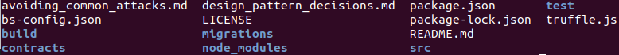
Next, we will deploy the dapp to the Ganache CLI development blockchain.
```
truffle migrate
```
The output should look something like this:
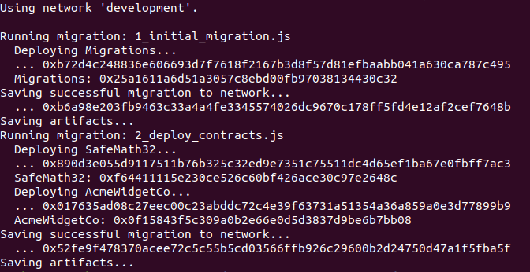
Next, we will use lite-server to serve up the web User Interface.
```
npm run dev
```
The web browser will pop up and Metamask will ask you to log in.
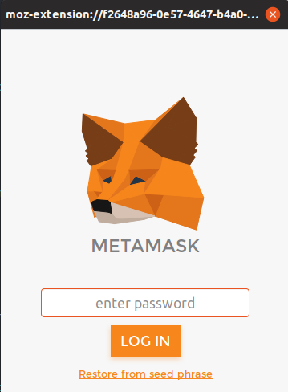
Click "Restore from seed phrase".  Paste in the mnemonic we saved earlier, enter a password, and click OK.
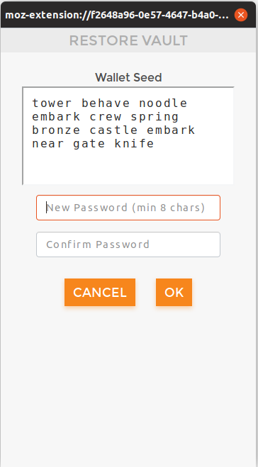
Then Metamask will ask for your approval. Click Approve button.
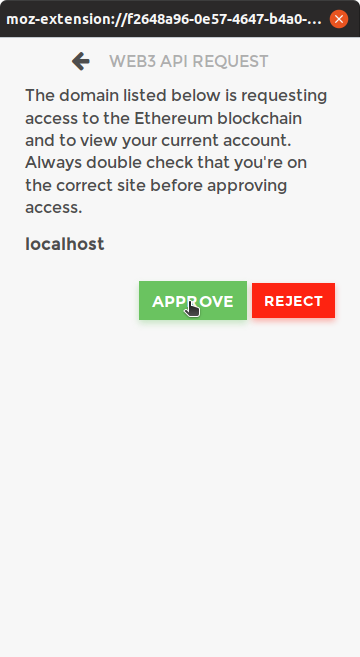
Now, make sure we are connected to localhost port 8545, by going to Metmask in the top right corner of the browser and selecting the "Localhost 8545" network from the dropdown menu.
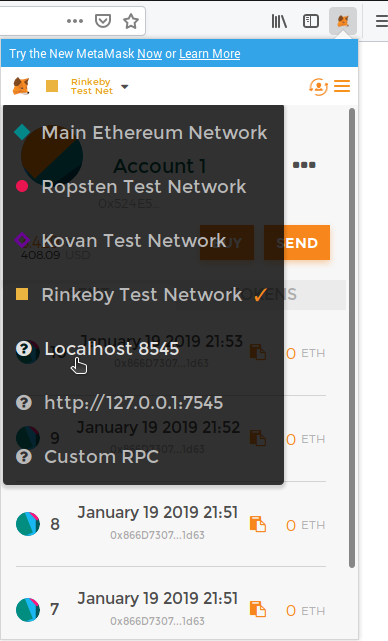
Make sure Account 1 is selected in Metamask.
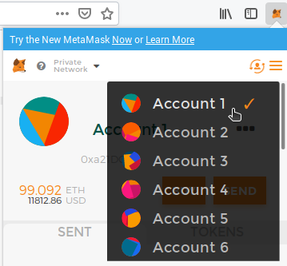
You will see that the current Ethereum account number (i.e. Account 1) is displayed in the application.  
Account 1 is the deployer of the contract, and the constructor sets up the deployer as the first Admin for the application.  
Click on the Login button.  
Here you see all the admin functions:
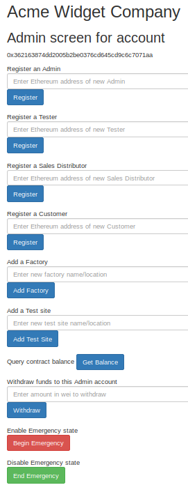
To demonstrate all the funcitonality of the application would take a long time and a lot of cut and paste to have you step through it yourself, so you can find a video demonstrating how the application is used on YouTube:
[](http://www.youtube.com/watch?v=d3RNenV85ok)
What you will see in the video (no audio):
* Deployer ([0]/Account 1) is the first Admin and adds the other users from the accounts associated with this mnemonic.  This is required because function access is based on registered role.
  * A second admin ([1]/Account 2)
  * A Tester ([2]/Account 3)
  * A Sales Distributor ([3]/Account 4)
  * A Customer ([4]/Account 5)
* Deployer adds some factories and test sites, which the tester will reference later
* Deployer checks the contract balance (0, since no widgets have been sold)
* Tester adds some widgets to the blockchain (before that, we didn't have any widgets recorded)
  * See code comments explaining how to interpret the test result hex string
* Sales Distributor updates the bin unit price
  * Using the browser console, we can see what the previous price was & see that it got updated
  * Similarly for the test mask
  * Mask corresponds to what bits must be 1 in test result to make it into that bin
* Then the circuit breaker is enabled by the second admin (Account 2)
* We show that the Customer can't buy any widgets because the contract is stopped
* Then the Admin ends the emergency (disables the circuit breaker)
* Then the customer is able to buy widgets
  * I forgot to show that originally, bin 1 had lastWidgetSoldInBin[1] == 0. After the purchase, it becomes 2.  
  * Since I didn't want to re-start shooting the video from the beginning, I just show that bin 2 has lastWidgetSoldInBin[1] == 0 to start with.  It's all the same, since it's a freshly deployed contract for the demo (because the DApp disallows registration of accounts that have already been registered)


#### Rinkeby

##### Interacting with the already-deployed contracts

See deployed_addresses.txt for the addresses of the contracts.

Because this DApp has role-based access for security purposes, your Ethereum account wouldn't already be registered as an approved user.  So, you would not be allowed to call any functions that modify state.  However, you can interact with the contract by calling the getter functions for any of the public variables, since those don't have role-based checks.

TODO: Put example here

##### How I deployed and tested the contract on Rinkeby
.env file

Infura

Accounts 1 to 5 based on the mnemonic in your .env with Rinkeby testnet ether (Can request the max from faucet to one account & then send it to the other accounts).  Account 1 should have the max, and it's probably sufficient to transfer just 2 ETH to each of the others, for basic testing.

##### Future work: truffle test --network rinkeby

As far as I can tell from reading the project requirements, the contracts just have to be deployed on Rinkeby such that they can be interacted with manually to fulfil the requirements.  It didn't have to pass
```
truffle test --network rinkeby
```

Right now, only 7 of the 14 automated tests pass on Rinkeby, even though all 14 pass on Ganache CLI.  For some of them, I know it's because the revert error messages that I am looking for in catchRevert are different strings on Rinkeby, so the test fails.  For a couple, further debug is required, but I won't get a chance to do that before the project is due.  
